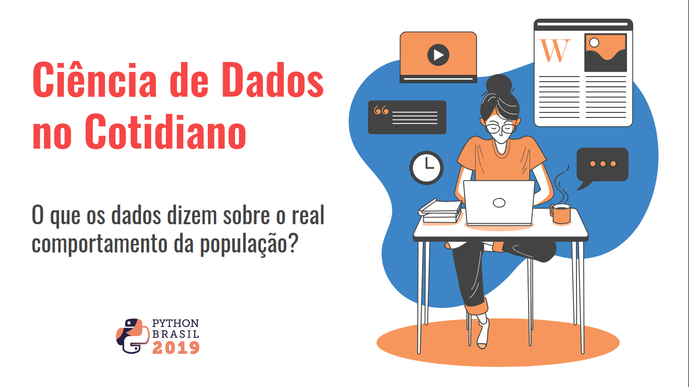

# Palestra PyBr[15]

> Ciência de Dados no Cotidiano - O que os dados dizem sobre o real comportamento da população?

* [Screen time stats 2019: Here’s how much you use your phone during the workday](https://blog.rescuetime.com/screen-time-stats-2018/)
* [Shock! Horror! Do you know how much time you spend on your phone?](https://www.theguardian.com/lifeandstyle/2019/aug/21/cellphone-screen-time-average-habits)
* [How Much Data is Generated Each Day?](https://www.visualcapitalist.com/how-much-data-is-generated-each-day/)
* [It’s not you. Phones are designed to be addicting](https://www.vox.com/2018/2/27/17053758/phone-addictive-design-google-apple)
* [Parcerias românticas e a dispersão de laços sociais: uma análise em rede do status de relacionamento no Facebook](https://dl.acm.org/citation.cfm?id=2531642)
* [Lei Geral de Proteção de Dados (LGPD)](https://nic.br/media/docs/publicacoes/3/13255120191015-revistabr-ano-10-2019-edicao16.pdf)
* [Donald Trump x Hilary Clinton](http://static1.squarespace.com/static/51d894bee4b01caf88ccb4f3/t/51d89ab3e4b05a25fc1f39d4/1373149875469/RacialAnimusAndVotingSethStephensDavidowitz.pdf)
* [Assuntos mais pesquisados em 2018 no Brasil](https://trends.google.com.br/trends/yis/2018/BR/)
